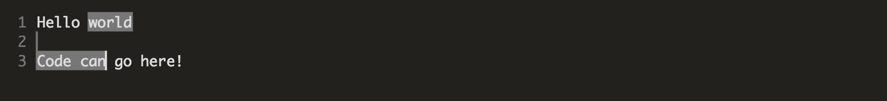

## Code editor with canvas

[View demo here](https://editor.gkaemmer.com)

This is an attempt to make a native-feeling code editor where all code is rendered to a canvas, instead of being rendered with the DOM (as with [Ace](https://ace.c9.io/) and similar projects).

For now it's just a prototype, but this type of rendering could (maybe) simplify dealing with multiselect, buffering different parts of the file, and ease . It's also just an interesting exercise to find all the little things we're used to when we edit text.

### TODO

So many things

- Scrolling/buffering
- File I/O
- Copying/cutting (pasting already works)
- Double/triple clicking to select words/lines
- More keyboard shortcuts (ctrl-a, etc)
- Finding/replacing
- Dead keys (ä, é, etc)
- Endless features...
